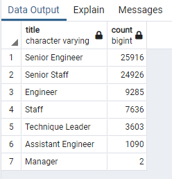
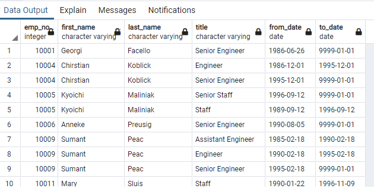

# Pewlett-Hackard-Analysis

# Overview
## Purpose:
- Pewlett-Hackard is about to loose a significant portion of senior staff due to their retirement eligibility.
- Pewlett-Hackard's HR department is asking to evaluate and analyse database of those who are set to retire.

## Goals:
Generate list of all employees who are eligible for retirement.

## Methodology:
SQL data engineering and modeling.

# Results:
Pewlett-Hackard's employee database analysis reveals the following:
- The majority of those who are set to retire hold the most senior positions
- Almost 70% of those retiring are "senior engineers" and "senior staff" 

- In order to close the gap between the leaving senior professionals and junior positions, the Mentorship Program should be well-functioning.  It will serve as a knowledge transfer. 
- The Mentorship Eligibility Program has sufficient amount of senior mentors who can help new or existing Pewlett-Hackard professionals transition into more senior positions 

IMAGE HERE MENTOR

# Summary:
- In order for Pewlett-Hackard to close the critical gap of leaving "talent and expertise," it is suggested that the company closely monitors those who may retire soon and those who are farther in the process.  This can be done by looking closely at "birth_data" since it correlates to retirement.

- Employees; however, can retire whenever they want and may not give much notice.  For that reason, Pewlett-Hackard's Mentorship Program should be set in place and running  as a learning opportunity for younger workers. Furthermore, it is suggested that Pewlett-Hackard identifies areas of operations in which people are not retiring as expected.  Employers may be able to keep older workers and at the same time avoid sudden "silver tsunami" by possibly offering them new roles that might be less intensive for instance allowing them to work part-time. 

